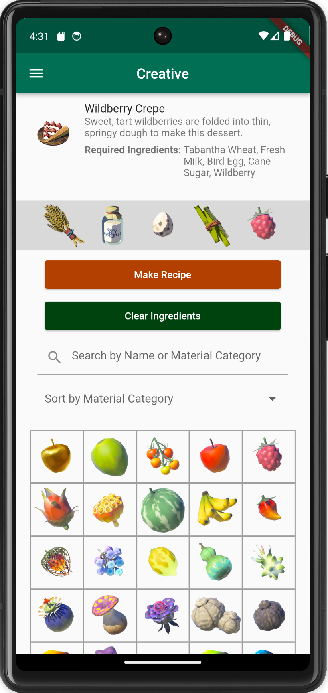
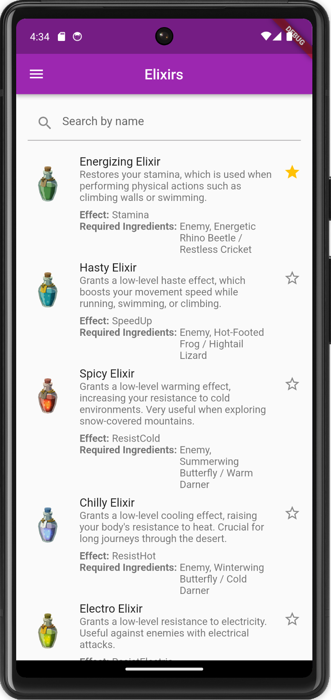
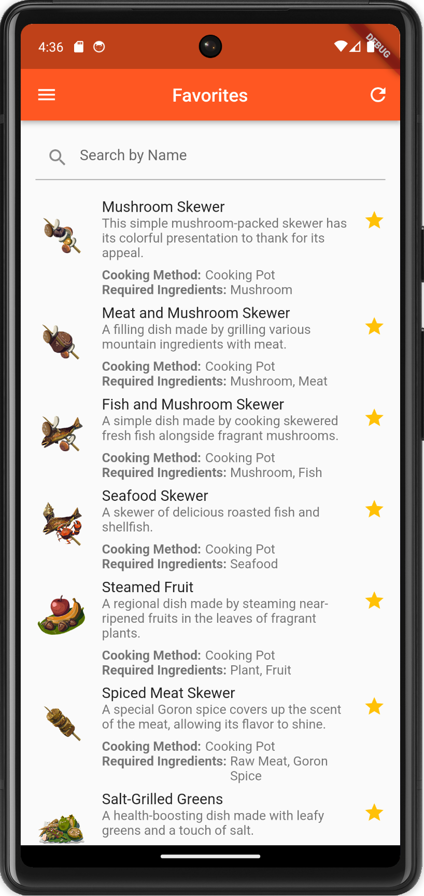
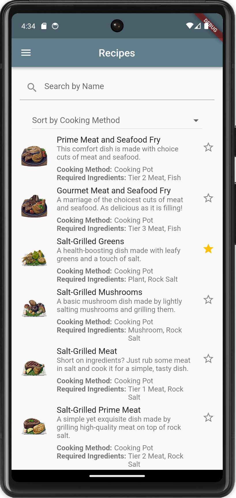
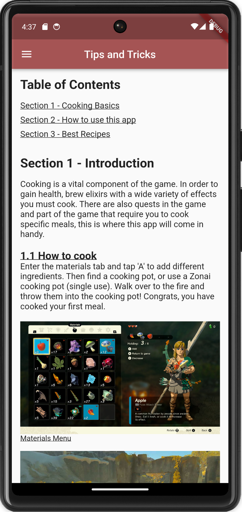

# Zelda TOTK Cooking Guide

A comprehensive cooking guide app for The Legend of Zelda: Breath of the Wild's Trial of the Kitchen. The app allows you to explore various recipes, ingredients, and cooking tips to enhance your gameplay experience. It is built using Flutter framework.

## Installation

To run the app locally, make sure you have Flutter installed on your system. Then, follow these steps:

1. Clone the repository:

   ```bash
   git clone https://github.com/your-username/zelda-totk-cooking-guide.git

2. Navigate to the project directory:
    ```bash
    cd zelda-totk-cooking-guide

3. Install the dependencies
    ```bash
    flutter pub get

## Features

1. **Creative Mode:** Experiment with different ingredient combinations to discover new recipes.
2. **Recipes and Elixirs:** Explore a comprehensive collection of recipes and elixirs. The app provides searching and categorical sorting functionality. You can also mark your favorite recipes which are stored locally.
3. **Materials Information:** Access detailed information about all of the materials found in the game.
4. **Tips and Tricks:** A blog-style section containing helpful tips, tricks, and some of my favorite recipes.

## Directory Structure
lib/  
├── models  
├── screens  
└── widgets

* **models:** Contains the code for parsing the CSV files and generating corresponding objects.
* **screens:** Includes the app's different pages and screens.
* **widgets:** Contains the reusable widgets used throughout the app.

The project also includes an `assets` folder with the following structure:

assets/  
├── csv  
├── materials  
├── recipes  
└── tips_and_tricks  

* **csv:** Contains the CSV files that store the information for the game.
* **materials:** Contains image assets for the materials in the game.
* **recipes:** Contains image assets for the recipes in the game.
* **tips_and_tricks:** Includes images used in the tips and tricks section of the app.

## Screenshots




